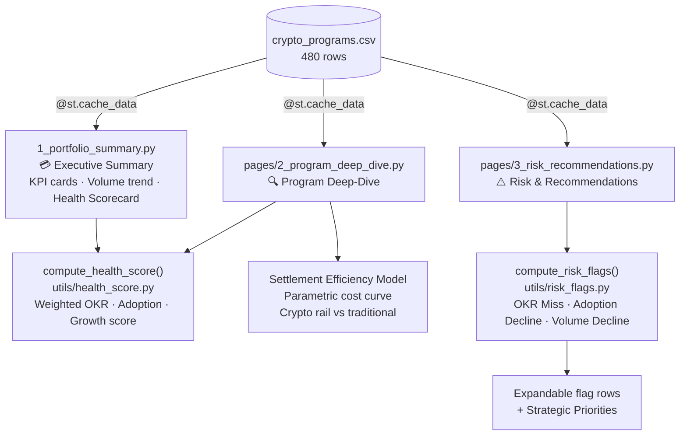

# Visa Crypto Portfolio Analyst

This project models the operational analytics work performed by a Business Analyst embedded in Visa's Growth Products & Partnerships team. It synthesises 480 rows of synthetic transaction data across 4 crypto programs, 5 regions, and 24 months to surface portfolio health, OKR attainment, partner adoption trends, and settlement efficiency. The centrepiece is a Program Health Scorecard and automated Risk Flag Engine -- the kind of tools a Chief of Staff uses to inform executive decisions and anticipate issues before they escalate.

## Live Dashboard

**URL:** https://crypto-analyst-jzvweqygfjactyyhdbv8bo.streamlit.app/

## Job Posting

- **Role:** Business Analyst, Operations & Strategy
- **Company:** Visa Inc. -- Growth Products & Partnerships

This project directly demonstrates the role's core success criteria: clean and trusted portfolio data, exec-ready synthesis, and tools that anticipate issues rather than react to them.

## Tech Stack

| Layer | Tool |
|---|---|
| Data | Synthesized CSV -- Python generator script |
| Data Processing | Pandas |
| Scoring Model | Python pure functions (`compute_health_score`, `compute_risk_flags`) |
| Visualisation | Altair |
| Dashboard | Streamlit (three-page multipage app) |
| Testing | pytest (11 unit tests) |
| Deployment | Streamlit Community Cloud |

## Pipeline Diagram



## Dashboard Pages

**Page 1 -- Portfolio Executive Summary:** Portfolio KPI cards (volume, OKR attainment, growth, partners), 12-month volume trend by program, and a colour-coded Program Health Scorecard ranking all four programs.

**Page 2 -- Program Deep-Dive:** Program selector with volume vs OKR target overlay, OKR attainment bar chart (colour-coded by status), partner adoption by region, and a Settlement Efficiency Model showing where the program sits on the crypto-rail vs traditional-rail cost curve.

**Page 3 -- Risk & Recommendations:** Automated flag engine surfacing OKR misses, adoption declines, and volume declines with exec-ready one-line recommendations. Closes with a static Strategic Priorities section formatted as a QBR talking point.

## Key Insights

**Portfolio health:** Visa x Coinbase Card leads on health score -- highest OKR attainment and partner adoption. Crypto B2B Partnerships trails, driven by a steep OKR stretch target (20% above base) and lower adoption maturity.

**Settlement efficiency:** USDC Settlement Rails and Crypto B2B Partnerships (avg transactions of $50K and $12K respectively) generate material cost savings vs traditional rails -- the settlement efficiency model shows savings of 0.10-0.13% of volume at current scale. Card programs (avg ~$400/txn) sit near the break-even point.

**Risk flags:** MEA lags across all programs on partner adoption (82-84%) and has begun missing OKR targets -- pointing to infrastructure gaps rather than product-market fit issues. LAC Crypto B2B shows consecutive adoption decline, flagged for outreach.

**Recommendation:** Prioritise MEA partner enablement investment before Q3 and expand the LAC B2B partner pipeline to 8+ active partners to absorb single-partner volatility.

## Setup & Reproduction

**Requirements:** Python 3.10+

```bash
pip install streamlit altair pandas numpy pytest

# Run the dashboard (from streamlit_app/)
cd streamlit_app
streamlit run 1_portfolio_summary.py

# Run tests (from project root)
pytest

# Regenerate dataset
cd streamlit_app
python generate_data.py
```

## Repository Structure

    .
    ├── streamlit_app/
    │   ├── 1_portfolio_summary.py        # Page 1: Executive Summary + Health Scorecard
    │   ├── pages/
    │   │   ├── 2_program_deep_dive.py    # Page 2: Program selector + Efficiency Model
    │   │   └── 3_risk_recommendations.py # Page 3: Risk flags + Strategic Priorities
    │   ├── utils/
    │   │   ├── data_loader.py            # Shared cached CSV loader
    │   │   ├── health_score.py           # compute_health_score() pure function
    │   │   └── risk_flags.py             # compute_risk_flags() pure function
    │   ├── data/
    │   │   └── crypto_programs.csv       # 480 rows synthetic dataset
    │   └── generate_data.py              # Synthetic data generator
    ├── tests/
    │   ├── test_health_score.py          # 6 unit tests
    │   └── test_risk_flags.py            # 5 unit tests
    ├── pytest.ini
    └── README.md
