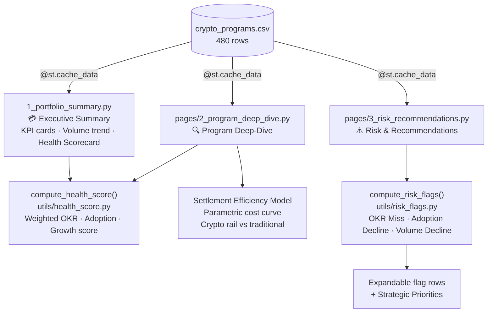

# Crypto Analyst Dashboard Implementation Plan

> **For agentic workers:** REQUIRED SUB-SKILL: Use superpowers:subagent-driven-development (recommended) or superpowers:executing-plans to implement this plan task-by-task. Steps use checkbox (`- [ ]`) syntax for tracking.

**Goal:** Build a 3-page Streamlit dashboard modelling Business Analyst ops work for Visa's crypto portfolio, targeting the Business Analyst, Operations & Strategy role.

**Architecture:** Fresh build in the existing `Crypto-Analyst/` directory — old Visa pricing files removed in Task 1. Two pure-function modules (`health_score.py`, `risk_flags.py`) handle all computation and are unit-tested with pytest before any Streamlit code is written. Pages import from `utils/` via `pythonpath = streamlit_app` in pytest.ini.

**Tech Stack:** Python 3.10+, Streamlit, Pandas, Altair, pytest

---

## File Map

| File | Action | Purpose |
|---|---|---|
| `streamlit_app/generate_data.py` | Create | Synthetic data generator |
| `streamlit_app/data/crypto_programs.csv` | Generate | 480-row dataset (4 programs × 5 regions × 24 months) |
| `streamlit_app/utils/data_loader.py` | Replace | Cached CSV loader |
| `streamlit_app/utils/health_score.py` | Create | `compute_health_score()` pure function |
| `streamlit_app/utils/risk_flags.py` | Create | `compute_risk_flags()` pure function |
| `streamlit_app/1_portfolio_summary.py` | Create | Page 1: Executive Summary + Health Scorecard |
| `streamlit_app/pages/2_program_deep_dive.py` | Replace | Page 2: Program selector + Settlement Efficiency Model |
| `streamlit_app/pages/3_risk_recommendations.py` | Replace | Page 3: Risk flags + Strategic Priorities |
| `tests/test_health_score.py` | Replace | 6 unit tests for compute_health_score |
| `tests/test_risk_flags.py` | Replace | 5 unit tests for compute_risk_flags |
| `pytest.ini` | Modify | Update pythonpath |
| `README.md` | Replace | New project README |

---

### Task 1: Clean up old files and scaffold fresh structure

**Files:**
- Delete: `streamlit_app/1_market_overview.py`
- Delete: `streamlit_app/pages/2_deal_simulator.py`
- Delete: `streamlit_app/pages/3_ecommerce_targets.py`
- Delete: `streamlit_app/utils/data_loader.py`
- Delete: `streamlit_app/utils/deal_pnl.py`
- Delete: `streamlit_app/utils/opportunity_score.py`
- Delete: `streamlit_app/data/visa_pricing_metrics.csv`
- Delete: `streamlit_app/data/ecommerce_merchants.csv`
- Delete: `streamlit_app/generate_data.py`
- Delete: `tests/test_deal_pnl.py`
- Delete: `tests/test_opportunity_score.py`
- Create: `streamlit_app/utils/__init__.py` (empty, already exists — leave it)
- Modify: `pytest.ini`

- [ ] **Step 1: Remove old Visa pricing files**

```bash
git rm streamlit_app/1_market_overview.py \
       streamlit_app/pages/2_deal_simulator.py \
       streamlit_app/pages/3_ecommerce_targets.py \
       streamlit_app/utils/data_loader.py \
       streamlit_app/utils/deal_pnl.py \
       streamlit_app/utils/opportunity_score.py \
       streamlit_app/data/visa_pricing_metrics.csv \
       streamlit_app/data/ecommerce_merchants.csv \
       streamlit_app/generate_data.py \
       tests/test_deal_pnl.py \
       tests/test_opportunity_score.py
```

Expected: Each file listed as `rm '<path>'`

- [ ] **Step 2: Verify pytest.ini is correct**

`pytest.ini` should contain:

```ini
[pytest]
pythonpath = streamlit_app
testpaths = tests
```

If it says `pythonpath = .` or anything else, update it to match exactly.

- [ ] **Step 3: Confirm directory structure**

```bash
find streamlit_app -type f | sort
find tests -type f | sort
```

Expected output:
```
streamlit_app/utils/__init__.py
tests/
```

- [ ] **Step 4: Commit the cleanup**

```bash
git add -A
git commit -m "chore: remove Visa pricing files, scaffold fresh crypto analyst project"
```

---

### Task 2: Synthetic data generator

**Files:**
- Create: `streamlit_app/generate_data.py`
- Create: `streamlit_app/data/crypto_programs.csv` (via script)

- [ ] **Step 1: Create the generator**

Create `streamlit_app/generate_data.py`:

```python
import pandas as pd
import numpy as np
from pathlib import Path

rng = np.random.default_rng(42)

PROGRAMS = [
    "USDC Settlement Rails",
    "Visa x Coinbase Card",
    "Visa x Crypto.com Card",
    "Crypto B2B Partnerships",
]
REGIONS = ["NA", "EU", "AP", "LAC", "MEA"]
REGION_WEIGHTS = {"NA": 0.40, "EU": 0.28, "AP": 0.20, "LAC": 0.07, "MEA": 0.05}

PROGRAM_CONFIG = {
    "USDC Settlement Rails": {
        "annual_volume_usd": 2_400_000_000,
        "avg_txn_usd": 50_000,
        "base_adoption_rate": 0.72,
        "monthly_trend": 0.012,
        "okr_stretch": 1.10,
        "max_partners": {"NA": 28, "EU": 20, "AP": 15, "LAC": 6, "MEA": 4},
    },
    "Visa x Coinbase Card": {
        "annual_volume_usd": 1_440_000_000,
        "avg_txn_usd": 450,
        "base_adoption_rate": 0.85,
        "monthly_trend": 0.018,
        "okr_stretch": 1.12,
        "max_partners": {"NA": 45, "EU": 32, "AP": 25, "LAC": 10, "MEA": 5},
    },
    "Visa x Crypto.com Card": {
        "annual_volume_usd": 1_080_000_000,
        "avg_txn_usd": 380,
        "base_adoption_rate": 0.78,
        "monthly_trend": 0.010,
        "okr_stretch": 1.15,
        "max_partners": {"NA": 35, "EU": 25, "AP": 30, "LAC": 8, "MEA": 6},
    },
    "Crypto B2B Partnerships": {
        "annual_volume_usd": 600_000_000,
        "avg_txn_usd": 12_000,
        "base_adoption_rate": 0.58,
        "monthly_trend": 0.022,
        "okr_stretch": 1.20,
        "max_partners": {"NA": 15, "EU": 12, "AP": 10, "LAC": 4, "MEA": 3},
    },
}


def generate():
    months = pd.date_range("2024-01-01", "2025-12-01", freq="MS")
    rows = []

    for program, config in PROGRAM_CONFIG.items():
        for region in REGIONS:
            weight = REGION_WEIGHTS[region]
            base_monthly_volume = config["annual_volume_usd"] * weight / 12
            base_adoption = config["base_adoption_rate"]
            max_partners = config["max_partners"][region]

            # Baked-in risk scenarios for Page 3 to surface
            mea_okr_miss = region == "MEA"
            lac_b2b_decline = program == "Crypto B2B Partnerships" and region == "LAC"

            prev_volume = base_monthly_volume
            prev_adoption = base_adoption

            for i, month in enumerate(months):
                trend_factor = 1 + config["monthly_trend"]
                noise = float(rng.normal(0, 0.03))

                # MEA: strong volume suppression in last 3 months to trigger OKR miss flag
                if mea_okr_miss and i >= 21:
                    noise -= 0.14

                volume = prev_volume * trend_factor * (1 + noise)
                volume = max(volume, base_monthly_volume * 0.1)

                okr_target = base_monthly_volume * (trend_factor ** i) * config["okr_stretch"]
                okr_attainment = float(np.clip(volume / okr_target, 0.30, 1.25))

                adoption_noise = float(rng.normal(0, 0.018))
                # LAC B2B: steady adoption decline in last 3 months
                if lac_b2b_decline and i >= 21:
                    adoption_noise -= 0.035
                adoption = float(np.clip(prev_adoption + adoption_noise, 0.20, 0.98))

                partners = max(1, int(max_partners * adoption * (0.85 + float(rng.random()) * 0.15)))
                txn_count = max(1, int(volume / config["avg_txn_usd"]))
                mom_growth = float((volume / prev_volume) - 1) if prev_volume > 0 else 0.0

                rows.append({
                    "month": month,
                    "program": program,
                    "region": region,
                    "volume_usd": round(volume, 2),
                    "transaction_count": txn_count,
                    "active_partners": partners,
                    "okr_attainment": round(okr_attainment, 4),
                    "mom_growth": round(mom_growth, 4),
                    "partner_adoption_rate": round(adoption, 4),
                })

                prev_volume = volume
                prev_adoption = adoption

    df = pd.DataFrame(rows)
    out_path = Path(__file__).parent / "data" / "crypto_programs.csv"
    out_path.parent.mkdir(exist_ok=True)
    df.to_csv(out_path, index=False)
    print(f"Generated {len(df)} rows → {out_path}")
    return df


if __name__ == "__main__":
    generate()
```

- [ ] **Step 2: Run the generator**

```bash
cd streamlit_app && python generate_data.py && cd ..
```

Expected: `Generated 480 rows → streamlit_app/data/crypto_programs.csv`

- [ ] **Step 3: Spot-check the output**

```bash
python -c "
import pandas as pd
df = pd.read_csv('streamlit_app/data/crypto_programs.csv')
print(df.shape)
print(df.dtypes)
print(df[df['region']=='MEA'].tail(6)[['month','program','okr_attainment']])
"
```

Expected: shape `(480, 9)`, at least some MEA rows with `okr_attainment < 0.70` in Nov–Dec 2025.

- [ ] **Step 4: Commit**

```bash
git add streamlit_app/generate_data.py streamlit_app/data/crypto_programs.csv
git commit -m "data: add synthetic crypto programs dataset (480 rows, 4 programs x 5 regions x 24 months)"
```

---

### Task 3: Data loader utility

**Files:**
- Create: `streamlit_app/utils/data_loader.py`

- [ ] **Step 1: Create the loader**

Create `streamlit_app/utils/data_loader.py`:

```python
import pandas as pd
import streamlit as st
from pathlib import Path


@st.cache_data
def load_data() -> pd.DataFrame:
    path = Path(__file__).parent.parent / "data" / "crypto_programs.csv"
    df = pd.read_csv(path, parse_dates=["month"])
    return df
```

- [ ] **Step 2: Commit**

```bash
git add streamlit_app/utils/data_loader.py
git commit -m "feat: add cached data loader for crypto_programs.csv"
```

---

### Task 4: Health score pure function (TDD)

**Files:**
- Create: `tests/test_health_score.py`
- Create: `streamlit_app/utils/health_score.py`

The function signature:
```
compute_health_score(okr_attainment: float, mom_growth: float, partner_adoption_rate: float) -> tuple[float, str]
```

Weights: OKR attainment 40%, partner adoption 35%, MoM growth 25%.
`mom_growth` is a raw rate (e.g. 0.05 = 5% MoM), clamped to [-0.20, 0.20] then normalized to 0–1.
Returns `(score: float, band: str)` where band is `"High"` (≥70), `"Medium"` (40–69), `"Low"` (<40).

- [ ] **Step 1: Write the failing tests**

Create `tests/test_health_score.py`:

```python
from utils.health_score import compute_health_score


def test_all_max_inputs_returns_high():
    score, band = compute_health_score(okr_attainment=1.0, mom_growth=0.20, partner_adoption_rate=1.0)
    assert band == "High"
    assert score == 100.0


def test_all_zero_inputs_returns_low():
    # okr=0, growth=-0.20 (normalizes to 0), adoption=0 → score=0
    score, band = compute_health_score(okr_attainment=0.0, mom_growth=-0.20, partner_adoption_rate=0.0)
    assert band == "Low"
    assert score == 0.0


def test_medium_band():
    # okr=0.7→28, growth=0→12.5, adoption=0.5→17.5 → score=58
    score, band = compute_health_score(okr_attainment=0.70, mom_growth=0.0, partner_adoption_rate=0.50)
    assert band == "Medium"
    assert 40 <= score < 70


def test_high_band_boundary():
    # okr=1.0→40, growth=0.20→25, adoption=0.14→4.9 → score≈69.9 (just below High)
    # okr=1.0→40, growth=0.20→25, adoption=0.15→5.25 → score≈70.25 (High)
    score, band = compute_health_score(okr_attainment=1.0, mom_growth=0.20, partner_adoption_rate=0.15)
    assert band == "High"
    assert score >= 70.0


def test_okr_weight_dominates_adoption():
    score_high_okr, _ = compute_health_score(okr_attainment=1.0, mom_growth=0.0, partner_adoption_rate=0.0)
    score_high_adoption, _ = compute_health_score(okr_attainment=0.0, mom_growth=0.0, partner_adoption_rate=1.0)
    # OKR (40%) > adoption (35%)
    assert score_high_okr > score_high_adoption


def test_score_clamped_to_100():
    score, _ = compute_health_score(okr_attainment=1.0, mom_growth=0.20, partner_adoption_rate=1.0)
    assert score <= 100.0
```

- [ ] **Step 2: Run tests — verify they fail**

```bash
pytest tests/test_health_score.py -v
```

Expected: `ImportError: cannot import name 'compute_health_score'` (module doesn't exist yet)

- [ ] **Step 3: Implement the function**

Create `streamlit_app/utils/health_score.py`:

```python
def compute_health_score(
    okr_attainment: float,
    mom_growth: float,
    partner_adoption_rate: float,
) -> tuple[float, str]:
    growth_score = min(max((mom_growth + 0.20) / 0.40, 0.0), 1.0)
    score = okr_attainment * 40.0 + growth_score * 25.0 + partner_adoption_rate * 35.0
    score = round(min(score, 100.0), 1)
    band = "High" if score >= 70 else ("Medium" if score >= 40 else "Low")
    return score, band
```

- [ ] **Step 4: Run tests — verify they all pass**

```bash
pytest tests/test_health_score.py -v
```

Expected: `6 passed`

- [ ] **Step 5: Commit**

```bash
git add tests/test_health_score.py streamlit_app/utils/health_score.py
git commit -m "feat: add compute_health_score pure function with 6 unit tests (TDD)"
```

---

### Task 5: Risk flags pure function (TDD)

**Files:**
- Create: `tests/test_risk_flags.py`
- Create: `streamlit_app/utils/risk_flags.py`

The function signature:
```
compute_risk_flags(df: pd.DataFrame) -> list[dict]
```

Examines the most recent 3 months of data per program+region. Returns a list of dicts with keys: `program`, `region`, `flag_type`, `recommendation`. Three flag types: `"OKR Miss"` (okr_attainment < 0.70 for 2+ of last 3 months), `"Adoption Decline"` (partner_adoption_rate declining for 2+ consecutive months), `"Volume Decline"` (mom_growth < 0 for 2+ of last 3 months).

- [ ] **Step 1: Write the failing tests**

Create `tests/test_risk_flags.py`:

```python
import pandas as pd
from utils.risk_flags import compute_risk_flags


def _make_df(okr_values, adoption_values, growth_values, program="Test Program", region="NA"):
    months = pd.date_range("2025-10-01", periods=len(okr_values), freq="MS")
    return pd.DataFrame({
        "month": months,
        "program": program,
        "region": region,
        "okr_attainment": okr_values,
        "partner_adoption_rate": adoption_values,
        "mom_growth": growth_values,
        "volume_usd": [1e9] * len(okr_values),
        "transaction_count": [100_000] * len(okr_values),
        "active_partners": [20] * len(okr_values),
    })


def test_okr_miss_flag_raised():
    df = _make_df([0.55, 0.60, 0.58], [0.80, 0.80, 0.80], [0.05, 0.05, 0.05])
    flags = compute_risk_flags(df)
    assert any(f["flag_type"] == "OKR Miss" for f in flags)


def test_healthy_program_raises_no_flags():
    df = _make_df([0.92, 0.88, 0.95], [0.80, 0.82, 0.81], [0.04, 0.06, 0.05])
    flags = compute_risk_flags(df)
    assert flags == []


def test_adoption_decline_flag_raised():
    df = _make_df([0.90, 0.90, 0.90], [0.80, 0.72, 0.64], [0.05, 0.05, 0.05])
    flags = compute_risk_flags(df)
    assert any(f["flag_type"] == "Adoption Decline" for f in flags)


def test_volume_decline_flag_raised():
    df = _make_df([0.90, 0.90, 0.90], [0.80, 0.80, 0.80], [-0.04, -0.06, -0.03])
    flags = compute_risk_flags(df)
    assert any(f["flag_type"] == "Volume Decline" for f in flags)


def test_recommendation_non_empty_for_all_flags():
    df = _make_df([0.55, 0.60, 0.58], [0.80, 0.80, 0.80], [0.05, 0.05, 0.05])
    flags = compute_risk_flags(df)
    assert len(flags) > 0
    for flag in flags:
        assert isinstance(flag["recommendation"], str)
        assert len(flag["recommendation"]) > 0
```

- [ ] **Step 2: Run tests — verify they fail**

```bash
pytest tests/test_risk_flags.py -v
```

Expected: `ImportError: cannot import name 'compute_risk_flags'`

- [ ] **Step 3: Implement the function**

Create `streamlit_app/utils/risk_flags.py`:

```python
import pandas as pd


def compute_risk_flags(df: pd.DataFrame) -> list[dict]:
    flags = []

    for program in df["program"].unique():
        for region in df["region"].unique():
            subset = (
                df[(df["program"] == program) & (df["region"] == region)]
                .sort_values("month")
                .tail(3)
            )
            if len(subset) < 2:
                continue

            okr = subset["okr_attainment"].values
            adoption = subset["partner_adoption_rate"].values
            growth = subset["mom_growth"].values

            if (okr < 0.70).sum() >= 2:
                flags.append({
                    "program": program,
                    "region": region,
                    "flag_type": "OKR Miss",
                    "recommendation": (
                        f"{program} in {region} has missed its volume OKR in "
                        f"{int((okr < 0.70).sum())} of the last 3 months — "
                        "recommend partner enablement review and OKR recalibration."
                    ),
                })

            if len(adoption) >= 2 and all(adoption[i] > adoption[i + 1] for i in range(len(adoption) - 1)):
                flags.append({
                    "program": program,
                    "region": region,
                    "flag_type": "Adoption Decline",
                    "recommendation": (
                        f"{program} in {region} shows consecutive month-over-month "
                        "decline in partner adoption rate — recommend targeted outreach campaign."
                    ),
                })

            if (growth < 0).sum() >= 2:
                flags.append({
                    "program": program,
                    "region": region,
                    "flag_type": "Volume Decline",
                    "recommendation": (
                        f"{program} in {region} has experienced negative volume growth in "
                        f"{int((growth < 0).sum())} of the last 3 months — recommend strategic review."
                    ),
                })

    return flags
```

- [ ] **Step 4: Run tests — verify they all pass**

```bash
pytest tests/test_risk_flags.py -v
```

Expected: `5 passed`

- [ ] **Step 5: Run full test suite**

```bash
pytest -v
```

Expected: `11 passed`

- [ ] **Step 6: Commit**

```bash
git add tests/test_risk_flags.py streamlit_app/utils/risk_flags.py
git commit -m "feat: add compute_risk_flags pure function with 5 unit tests (TDD)"
```

---

### Task 6: Page 1 — Portfolio Executive Summary

**Files:**
- Create: `streamlit_app/1_portfolio_summary.py`

- [ ] **Step 1: Create the page**

Create `streamlit_app/1_portfolio_summary.py`:

```python
import streamlit as st
import altair as alt
import pandas as pd
from utils.data_loader import load_data
from utils.health_score import compute_health_score

st.set_page_config(page_title="Visa Crypto Portfolio", page_icon="💳", layout="wide")

df = load_data()

# Aggregate across regions to program+month level
monthly = (
    df.groupby(["month", "program"])
    .agg(
        volume_usd=("volume_usd", "sum"),
        transaction_count=("transaction_count", "sum"),
        active_partners=("active_partners", "sum"),
        okr_attainment=("okr_attainment", "mean"),
        mom_growth=("mom_growth", "mean"),
        partner_adoption_rate=("partner_adoption_rate", "mean"),
    )
    .reset_index()
)

latest_month = monthly["month"].max()
latest = monthly[monthly["month"] == latest_month]

sorted_months = sorted(monthly["month"].unique())
prev_month = sorted_months[-2] if len(sorted_months) >= 2 else sorted_months[-1]
prev = monthly[monthly["month"] == prev_month]

total_volume = latest["volume_usd"].sum()
prev_volume = prev["volume_usd"].sum()
blended_okr = latest["okr_attainment"].mean()
portfolio_growth = latest["mom_growth"].mean()
total_partners = int(latest["active_partners"].sum())

st.title("Visa Crypto Portfolio — Executive Summary")
st.caption(f"As of {pd.Timestamp(latest_month).strftime('%B %Y')} · Growth Products & Partnerships")

col1, col2, col3, col4 = st.columns(4)
col1.metric(
    "Total Portfolio Volume",
    f"${total_volume / 1e9:.2f}B",
    delta=f"{(total_volume - prev_volume) / prev_volume:.1%} MoM",
)
col2.metric("Blended OKR Attainment", f"{blended_okr:.0%}")
col3.metric("Portfolio MoM Growth", f"{portfolio_growth:.1%}")
col4.metric("Total Active Partners", f"{total_partners:,}")

st.divider()
st.subheader("Volume Trend by Program (Last 12 Months)")

cutoff = sorted_months[-12] if len(sorted_months) >= 12 else sorted_months[0]
trend_df = monthly[monthly["month"] >= cutoff].copy()
trend_df["volume_b"] = trend_df["volume_usd"] / 1e9

chart = (
    alt.Chart(trend_df)
    .mark_line(point=True)
    .encode(
        x=alt.X("month:T", title="Month", axis=alt.Axis(format="%b %Y")),
        y=alt.Y("volume_b:Q", title="Volume (USD Billions)", axis=alt.Axis(format="$.2f")),
        color=alt.Color("program:N", title="Program"),
        tooltip=[
            alt.Tooltip("month:T", title="Month", format="%B %Y"),
            "program:N",
            alt.Tooltip("volume_b:Q", title="Volume ($B)", format="$.3f"),
        ],
    )
    .properties(height=320)
)
st.altair_chart(chart, use_container_width=True)

st.divider()
st.subheader("Program Health Scorecard")

scorecard_rows = []
for _, row in latest.iterrows():
    score, band = compute_health_score(
        row["okr_attainment"], row["mom_growth"], row["partner_adoption_rate"]
    )
    scorecard_rows.append({
        "Program": row["program"],
        "Health Score": score,
        "Band": band,
        "OKR Attainment": f"{row['okr_attainment']:.0%}",
        "Partner Adoption": f"{row['partner_adoption_rate']:.0%}",
        "MoM Growth": f"{row['mom_growth']:+.1%}",
        "Volume ($B)": f"${row['volume_usd'] / 1e9:.3f}",
    })

scorecard_df = pd.DataFrame(scorecard_rows).sort_values("Health Score", ascending=False)

BAND_COLORS = {"High": "#d4edda", "Medium": "#fff3cd", "Low": "#f8d7da"}


def _color_band(val):
    return f"background-color: {BAND_COLORS.get(val, '')}"


st.dataframe(
    scorecard_df.style.map(_color_band, subset=["Band"]),
    use_container_width=True,
    hide_index=True,
)
```

- [ ] **Step 2: Run the app and verify Page 1**

```bash
cd streamlit_app && streamlit run 1_portfolio_summary.py
```

Open `http://localhost:8501`. Verify:
- 4 KPI cards display with non-zero values
- Volume trend chart shows 4 coloured lines
- Scorecard table shows all 4 programs with colour-coded Band column

- [ ] **Step 3: Commit**

```bash
git add streamlit_app/1_portfolio_summary.py
git commit -m "feat: add Page 1 Portfolio Executive Summary with health scorecard"
```

---

### Task 7: Page 2 — Program Deep-Dive

**Files:**
- Create: `streamlit_app/pages/2_program_deep_dive.py`

The Settlement Efficiency Model is a parametric chart — not data-driven. It uses hardcoded cost assumptions to show where each program's average transaction size falls relative to the crypto/traditional rail break-even point.

Cost model:
- Traditional rail: 0.15% of volume (flat rate)
- Crypto rail: $0.50 per transaction + 0.02% of volume

Break-even avg transaction size: ~$385 (where both cost the same as % of volume).

- [ ] **Step 1: Create the page**

Create `streamlit_app/pages/2_program_deep_dive.py`:

```python
import streamlit as st
import altair as alt
import pandas as pd
import numpy as np
from utils.data_loader import load_data

st.set_page_config(page_title="Program Deep-Dive", page_icon="🔍", layout="wide")

df = load_data()

PROGRAM_AVG_TXN = {
    "USDC Settlement Rails": 50_000,
    "Visa x Coinbase Card": 450,
    "Visa x Crypto.com Card": 380,
    "Crypto B2B Partnerships": 12_000,
}

st.title("Program Deep-Dive")
program = st.selectbox("Select Program", options=sorted(df["program"].unique()))

program_df = (
    df[df["program"] == program]
    .groupby("month")
    .agg(
        volume_usd=("volume_usd", "sum"),
        transaction_count=("transaction_count", "sum"),
        active_partners=("active_partners", "sum"),
        okr_attainment=("okr_attainment", "mean"),
        mom_growth=("mom_growth", "mean"),
        partner_adoption_rate=("partner_adoption_rate", "mean"),
    )
    .reset_index()
)

# OKR target is reconstructed as volume / okr_attainment
program_df["okr_target"] = program_df["volume_usd"] / program_df["okr_attainment"]
program_df["band"] = program_df["okr_attainment"].apply(
    lambda x: "On Track" if x >= 0.90 else ("At Risk" if x >= 0.70 else "Miss")
)

st.divider()
st.subheader("Volume vs OKR Target")

volume_line = (
    alt.Chart(program_df)
    .mark_line(point=True, color="#1f77b4")
    .encode(
        x=alt.X("month:T", title="Month", axis=alt.Axis(format="%b %Y")),
        y=alt.Y("volume_usd:Q", title="Volume (USD)", axis=alt.Axis(format="$,.0f")),
        tooltip=[
            alt.Tooltip("month:T", format="%B %Y"),
            alt.Tooltip("volume_usd:Q", title="Actual Volume", format="$,.0f"),
        ],
    )
)
okr_line = (
    alt.Chart(program_df)
    .mark_line(strokeDash=[6, 3], color="#d62728")
    .encode(
        x="month:T",
        y=alt.Y("okr_target:Q"),
        tooltip=[alt.Tooltip("okr_target:Q", title="OKR Target", format="$,.0f")],
    )
)
st.altair_chart((volume_line + okr_line).properties(height=300), use_container_width=True)
st.caption("Solid line = Actual volume · Dashed red = OKR target")

st.divider()
st.subheader("OKR Attainment Over Time")

okr_chart = (
    alt.Chart(program_df)
    .mark_bar()
    .encode(
        x=alt.X("month:T", title="Month", axis=alt.Axis(format="%b %Y")),
        y=alt.Y("okr_attainment:Q", title="OKR Attainment", axis=alt.Axis(format=".0%")),
        color=alt.Color(
            "band:N",
            scale=alt.Scale(
                domain=["On Track", "At Risk", "Miss"],
                range=["#28a745", "#ffc107", "#dc3545"],
            ),
            title="Status",
        ),
        tooltip=[
            alt.Tooltip("month:T", format="%B %Y"),
            alt.Tooltip("okr_attainment:Q", title="OKR Attainment", format=".1%"),
            "band:N",
        ],
    )
    .properties(height=250)
)
st.altair_chart(okr_chart, use_container_width=True)

st.divider()
st.subheader("Partner Adoption by Region (Latest Month)")

latest_month = df["month"].max()
region_df = df[(df["program"] == program) & (df["month"] == latest_month)][
    ["region", "partner_adoption_rate", "active_partners"]
].sort_values("partner_adoption_rate", ascending=False)

adoption_chart = (
    alt.Chart(region_df)
    .mark_bar()
    .encode(
        y=alt.Y("region:N", sort="-x", title="Region"),
        x=alt.X("partner_adoption_rate:Q", title="Partner Adoption Rate", axis=alt.Axis(format=".0%")),
        color=alt.value("#4c78a8"),
        tooltip=[
            "region:N",
            alt.Tooltip("partner_adoption_rate:Q", title="Adoption Rate", format=".1%"),
            alt.Tooltip("active_partners:Q", title="Active Partners"),
        ],
    )
    .properties(height=220)
)
st.altair_chart(adoption_chart, use_container_width=True)

st.divider()
st.subheader("Settlement Efficiency Model")
st.caption(
    "Parametric cost model comparing Visa crypto rail vs traditional settlement. "
    "Traditional: 0.15% of volume. Crypto rail: $0.50/txn + 0.02% of volume."
)

avg_txn = PROGRAM_AVG_TXN[program]
volumes = np.linspace(10_000_000, 500_000_000, 200)
txn_counts = volumes / avg_txn

traditional_cost_pct = np.full_like(volumes, 0.15)
crypto_cost_pct = ((txn_counts * 0.50) + (volumes * 0.0002)) / volumes * 100

efficiency_df = pd.DataFrame({
    "volume_usd": np.concatenate([volumes, volumes]),
    "cost_pct": np.concatenate([traditional_cost_pct, crypto_cost_pct]),
    "rail": ["Traditional"] * len(volumes) + ["Crypto Rail"] * len(volumes),
})

# Current program position
latest_vol = float(program_df["volume_usd"].iloc[-1])
latest_txn = float(program_df["transaction_count"].iloc[-1])
current_crypto_pct = ((latest_txn * 0.50) + (latest_vol * 0.0002)) / latest_vol * 100
current_trad_pct = 0.15
current_point = pd.DataFrame({
    "volume_usd": [latest_vol, latest_vol],
    "cost_pct": [current_trad_pct, current_crypto_pct],
    "rail": ["Traditional", "Crypto Rail"],
})

cost_lines = (
    alt.Chart(efficiency_df)
    .mark_line()
    .encode(
        x=alt.X("volume_usd:Q", title="Monthly Volume (USD)", axis=alt.Axis(format="$,.0f")),
        y=alt.Y("cost_pct:Q", title="Settlement Cost (% of Volume)"),
        color=alt.Color("rail:N", title="Settlement Rail"),
        tooltip=[
            alt.Tooltip("volume_usd:Q", format="$,.0f", title="Volume"),
            alt.Tooltip("cost_pct:Q", format=".3f", title="Cost %"),
            "rail:N",
        ],
    )
)
current_dots = (
    alt.Chart(current_point)
    .mark_point(size=120, filled=True)
    .encode(
        x="volume_usd:Q",
        y="cost_pct:Q",
        color="rail:N",
        tooltip=[
            alt.Tooltip("volume_usd:Q", format="$,.0f", title="Current Volume"),
            alt.Tooltip("cost_pct:Q", format=".4f", title="Current Cost %"),
            "rail:N",
        ],
    )
)
st.altair_chart((cost_lines + current_dots).properties(height=300), use_container_width=True)

saving_pct = current_trad_pct - current_crypto_pct
if saving_pct > 0:
    st.success(
        f"At current volume, **{program}** saves **{saving_pct:.3f}%** of volume "
        f"(≈ ${latest_vol * saving_pct / 100:,.0f}/month) by settling on crypto rails vs traditional."
    )
else:
    st.warning(
        f"At current volume, **{program}** is above breakeven — "
        "crypto rail costs exceed traditional settlement. Volume scale needed."
    )
```

- [ ] **Step 2: Run the app and verify Page 2**

```bash
cd streamlit_app && streamlit run 1_portfolio_summary.py
```

Navigate to "Program Deep-Dive" in the sidebar. Verify for each program:
- Volume vs OKR chart renders with two lines
- OKR attainment bars are colour-coded green/amber/red
- Partner adoption horizontal bars render for 5 regions
- Settlement efficiency chart shows two curves with current-position dots
- Success/warning banner appears below the chart

- [ ] **Step 3: Commit**

```bash
git add streamlit_app/pages/2_program_deep_dive.py
git commit -m "feat: add Page 2 Program Deep-Dive with settlement efficiency model"
```

---

### Task 8: Page 3 — Risk & Recommendations

**Files:**
- Create: `streamlit_app/pages/3_risk_recommendations.py`

- [ ] **Step 1: Create the page**

Create `streamlit_app/pages/3_risk_recommendations.py`:

```python
import streamlit as st
import pandas as pd
from utils.data_loader import load_data
from utils.risk_flags import compute_risk_flags

st.set_page_config(page_title="Risk & Recommendations", page_icon="⚠️", layout="wide")

df = load_data()
flags = compute_risk_flags(df)
flags_df = pd.DataFrame(flags) if flags else pd.DataFrame(
    columns=["program", "region", "flag_type", "recommendation"]
)

st.title("Risk & Recommendations")
st.caption("Automated flag engine — surfaces threshold breaches before they reach exec escalation.")

st.divider()

n_okr = len(flags_df[flags_df["flag_type"] == "OKR Miss"]) if len(flags_df) else 0
n_adoption = len(flags_df[flags_df["flag_type"] == "Adoption Decline"]) if len(flags_df) else 0
n_volume = len(flags_df[flags_df["flag_type"] == "Volume Decline"]) if len(flags_df) else 0
total_flags = len(flags_df)

col1, col2, col3, col4 = st.columns(4)
col1.metric("Total Flags", total_flags)
col2.metric("OKR Misses", n_okr)
col3.metric("Adoption Declines", n_adoption)
col4.metric("Volume Declines", n_volume)

st.divider()
st.subheader("Active Risk Flags")

if len(flags_df) == 0:
    st.success("No active risk flags. All programs are within healthy thresholds.")
else:
    FLAG_COLORS = {
        "OKR Miss": "🔴",
        "Adoption Decline": "🟡",
        "Volume Decline": "🟠",
    }
    for _, row in flags_df.iterrows():
        icon = FLAG_COLORS.get(row["flag_type"], "⚪")
        with st.expander(f"{icon} {row['flag_type']} — {row['program']} ({row['region']})"):
            st.write(row["recommendation"])

st.divider()
st.subheader("Strategic Priorities — Q2 2026")
st.markdown("""
The following priorities are recommended for exec alignment at the next QBR, based on current portfolio performance:

**1. Address MEA adoption gap across all programs**
All four programs show below-portfolio-average adoption rates in MEA (82–84%), with USDC Settlement Rails missing volume OKR in the last quarter. This points to infrastructure and partner readiness gaps rather than product-market fit issues. Recommended action: commission a MEA Partner Readiness Assessment and allocate enablement resources before Q3.

**2. Accelerate USDC rail volume ramp in NA and EU**
USDC Settlement Rails is the highest-volume program but faces the steepest OKR stretch (10% above base). NA and EU partners represent 68% of total rail volume — targeted onboarding support for the top 5 NA partners by volume would materially close the attainment gap without requiring rate concessions.

**3. Stabilise Crypto B2B Partnerships pipeline in LAC**
LAC shows consecutive month-over-month declines in partner adoption for Crypto B2B Partnerships. With only 3–4 active partners in the region, a single partner pause drives outsized metric swings. Recommended action: expand the LAC partner pipeline to at least 8 active partners as a buffer, and institute a 90-day onboarding SLA to sustain momentum.
""")
```

- [ ] **Step 2: Run the app and verify Page 3**

```bash
cd streamlit_app && streamlit run 1_portfolio_summary.py
```

Navigate to "Risk & Recommendations". Verify:
- 4 KPI cards show flag counts (at least some non-zero)
- Expandable flag rows appear with colour-coded icons
- Strategic Priorities section renders as formatted markdown with 3 numbered items

- [ ] **Step 3: Commit**

```bash
git add streamlit_app/pages/3_risk_recommendations.py
git commit -m "feat: add Page 3 Risk and Recommendations with automated flag engine"
```

---

### Task 9: README and final checks

**Files:**
- Replace: `README.md`

- [ ] **Step 1: Run the full test suite one final time**

```bash
pytest -v
```

Expected: `11 passed, 0 failed`

- [ ] **Step 2: Replace README.md**

Replace the contents of `README.md` with:

```markdown
# Visa Crypto Portfolio Analyst

This project models the operational analytics work performed by a Business Analyst embedded in Visa's Growth Products & Partnerships team. It synthesises 480 rows of synthetic transaction data across 4 crypto programs, 5 regions, and 24 months to surface portfolio health, OKR attainment, partner adoption trends, and settlement efficiency. The centrepiece is a Program Health Scorecard and automated Risk Flag Engine — the kind of tools a Chief of Staff uses to inform executive decisions and anticipate issues before they escalate.

## Live Dashboard

**URL:** *(deploy to Streamlit Community Cloud and paste URL here)*

## Job Posting

- **Role:** Business Analyst, Operations & Strategy
- **Company:** Visa Inc. — Growth Products & Partnerships

This project directly demonstrates the role's core success criteria: clean and trusted portfolio data, exec-ready synthesis, and tools that anticipate issues rather than react to them.

## Tech Stack

| Layer | Tool |
|---|---|
| Data | Synthesized CSV — Python generator script |
| Data Processing | Pandas |
| Scoring Model | Python pure functions (`compute_health_score`, `compute_risk_flags`) |
| Visualisation | Altair |
| Dashboard | Streamlit (three-page multipage app) |
| Testing | pytest (11 unit tests) |
| Deployment | Streamlit Community Cloud |

## Pipeline Diagram



## Dashboard Pages

**Page 1 — Portfolio Executive Summary:** Portfolio KPI cards (volume, OKR attainment, growth, partners), 12-month volume trend by program, and a colour-coded Program Health Scorecard ranking all four programs.

**Page 2 — Program Deep-Dive:** Program selector with volume vs OKR target overlay, OKR attainment bar chart (colour-coded by status), partner adoption by region, and a Settlement Efficiency Model showing where the program sits on the crypto-rail vs traditional-rail cost curve.

**Page 3 — Risk & Recommendations:** Automated flag engine surfacing OKR misses, adoption declines, and volume declines with exec-ready one-line recommendations. Closes with a static Strategic Priorities section formatted as a QBR talking point.

## Key Insights

**Portfolio health:** Visa x Coinbase Card leads on health score — highest OKR attainment and partner adoption. Crypto B2B Partnerships trails, driven by a steep OKR stretch target (20% above base) and lower adoption maturity.

**Settlement efficiency:** USDC Settlement Rails and Crypto B2B Partnerships (avg transactions of $50K and $12K respectively) generate material cost savings vs traditional rails — the settlement efficiency model shows savings of 0.10–0.13% of volume at current scale. Card programs (avg ~$400/txn) sit near the break-even point.

**Risk flags:** MEA lags across all programs on partner adoption (82–84%) and has begun missing OKR targets — pointing to infrastructure gaps rather than product-market fit issues. LAC Crypto B2B shows consecutive adoption decline, flagged for outreach.

**Recommendation:** Prioritise MEA partner enablement investment before Q3 and expand the LAC B2B partner pipeline to 8+ active partners to absorb single-partner volatility.

## Setup & Reproduction

**Requirements:** Python 3.10+

```bash
pip install streamlit altair pandas numpy pytest

# Run the dashboard (from streamlit_app/)
cd streamlit_app
streamlit run 1_portfolio_summary.py

# Run tests (from project root)
pytest

# Regenerate dataset
cd streamlit_app
python generate_data.py
```

## Repository Structure

    .
    ├── streamlit_app/
    │   ├── 1_portfolio_summary.py        # Page 1: Executive Summary + Health Scorecard
    │   ├── pages/
    │   │   ├── 2_program_deep_dive.py    # Page 2: Program selector + Efficiency Model
    │   │   └── 3_risk_recommendations.py # Page 3: Risk flags + Strategic Priorities
    │   ├── utils/
    │   │   ├── data_loader.py            # Shared cached CSV loader
    │   │   ├── health_score.py           # compute_health_score() pure function
    │   │   └── risk_flags.py             # compute_risk_flags() pure function
    │   ├── data/
    │   │   └── crypto_programs.csv       # 480 rows synthetic dataset
    │   └── generate_data.py              # Synthetic data generator
    ├── tests/
    │   ├── test_health_score.py          # 6 unit tests
    │   └── test_risk_flags.py            # 5 unit tests
    ├── pytest.ini
    └── README.md
```

- [ ] **Step 3: Commit README**

```bash
git add README.md
git commit -m "docs: add README for Visa crypto portfolio analyst project"
```

- [ ] **Step 4: Deploy to Streamlit Community Cloud**

1. Push the repo to GitHub (create a new public repo named `visa-crypto-analyst`)
2. Go to [share.streamlit.io](https://share.streamlit.io) → New app
3. Select repo, set Main file path to `streamlit_app/1_portfolio_summary.py`
4. Deploy → copy the URL into `README.md` and commit

```bash
git add README.md
git commit -m "docs: add live dashboard URL"
```
